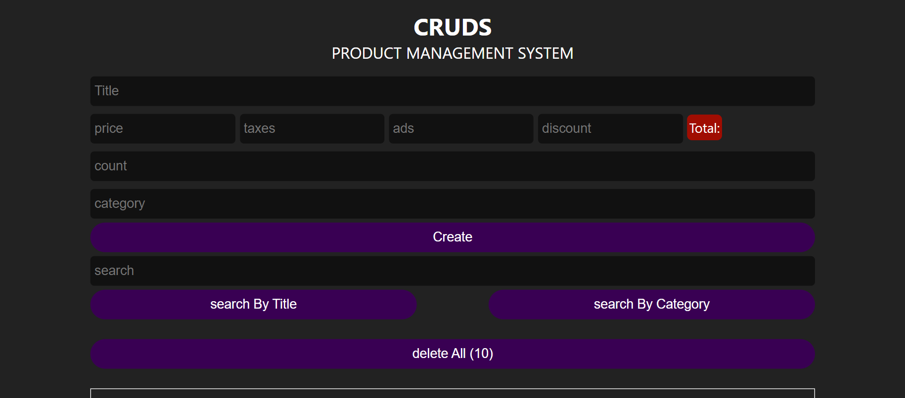

# CRUD

> This project is based on a CRUDS website for PRODUCT MANAGEMENT SYSTEM.

  

## Built with

- HTML
- CSS
- JavaScript

## Live demo

[My live demo](https://tahenybelguith.github.io/CRUD/) 

### Prerequisites

- Github Account
- IDE
- Git

### Setup

- git init
- git clone git@github.com:TahenyBELGUITH/CRUD.git

## Author:

### 👩 Taheny BELGUITH

- GitHub: [@TahenyBELGUITH](https://github.com/TahenyBELGUITH)
- Twitter: [@BelguithTaheny](https://twitter.com/BelguithTaheny)

### 🤝 Contributing

Contributions, issues, and feature requests are welcome!

> Feel free to check the issues page.

### Show your support

Give a ⭐️ if you like this project!

### 📝 License

This project is MIT licensed.
